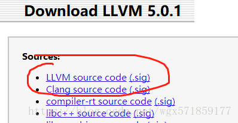

# win10下安装llvm和clang #

## 前提条件： ##

Windows 10环境下

VS2015已安装，Windows SDK已安装，cmake已安装

前两个没有安装的可以参考我的另一篇博客：https://blog.csdn.net/wgx571859177/article/details/80375215

cmake下载地址：https://cmake.org/download/

## 安装步骤： ##

下载llvm和clang源码包：http://releases.llvm.org/download.html#5.0.1

选择5.0以上版本



解压后，在llvm文件夹下面的../tools文件夹下建立clang文件夹，把clang解压缩后的文件拷贝进去

在llvm根目录下面建立一个名为build空文件夹用来放后续编译内容


**方法一：**

打开cmd，转到build文件夹下，执行

```
cmake -Thost=x64 -G "Visual Studio 14" F:\personal_soft\llvm\llvm-5.0.2.src\llvm-5.0.2
```

后面的路径为下载的llvm源码根目录，即cmakelist.txt所在的文件夹

编译中如果找不到C或者CXX compiler ,参考我的另一篇博客：https://blog.csdn.net/wgx571859177/article/details/80375289

如果成功编译，则可以在build文件夹下看到生成的llvm.sln工程，双击用VS打开，下拉找到ALL_BUILD工程，选中点击 '生成' 里面的生成解决方案进行build，这步耗时较长，若这步执行成功，可以看到在build\Debug\bin中包含了clang.exe等多个可执行文件，将该路径加入到环境变量中，就安装完成了。

最后可以在cmd中输入 clang --help 看是否安装成功！


**方法二：**

打开cmd，转到build文件夹下，执行如下两条命令

其中的install-path 和source-path 需要具体写为安装文件夹的路径和原代码的文件夹路径

```
cmake -Thost=x64 -DCMAKE_INSTALL_PREFIX=install-path -DLLVM_ENABLE_TERMINFO=OFF -DLLVM_TARGETS_TO_BUILD=X86;ARM;NVPTX;AArch64;Mips;Hexagon -DLLVM_ENABLE_ASSERTIONS=ON -DLLVM_BUILD_32_BITS=OFF -DCMAKE_BUILD_TYPE=Release source-path\llvm-5.0.2.src -G "Visual Studio 14 Win64"
 
cmake -DCMAKE_INSTALL_PREFIX=install-path -P cmake_install.cmake
```

参考网址：

https://blog.csdn.net/fan2273/article/details/76439042

https://www.cnblogs.com/saintlas/p/5738730.html

————————————————

版权声明：本文为CSDN博主「咸鱼半条」的原创文章，遵循CC 4.0 BY-SA版权协议，转载请附上原文出处链接及本声明。

原文链接：https://blog.csdn.net/wgx571859177/article/details/80376134